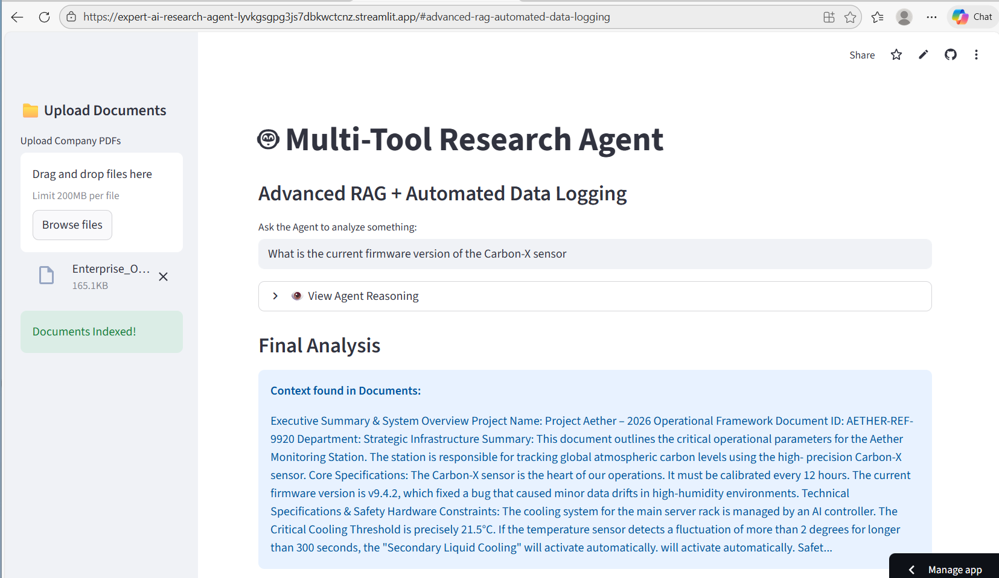

 Live Demo

Title: Enterprise Document Intelligence & Automated Auditing System.

The Challenge: 
         Organizations deal with "Information Overload," where critical insights are trapped in thousands of PDF pages. Manual data extraction is slow, expensive, and prone to human error.

The Solution: 
          I built an Agentic RAG (Retrieval-Augmented Generation) system. It doesn't just chat; it "thinks" by retrieving factual context from local documents and "acts" by automatically logging verified insights into a structured audit system. This project demonstrates how to bridge the gap between AI conversation and business process automation.

Key Features:
          Semantic Search Engine: Uses HuggingFace embeddings and FAISS to understand the meaning of your questions, not just keywords.

Privacy-First RAG: The entire knowledge base stays local. No data is sent to external LLM providers, ensuring corporate data security.

Automated Action Tool: Features a built-in "Confirm & Log" mechanism that writes verified AI analysis directly to a CSV audit trail.

Dynamic Document Indexing: Supports multi-PDF uploads with real-time text splitting and vectorization.

Technical Architecture:

Ingestion: PDFs are loaded and broken into small, meaningful chunks.

Vectorization: Text chunks are converted into mathematical vectors using the all-MiniLM-L6-v2 model.

Storage: Vectors are stored in a high-performance FAISS index.

Retrieval: When a user asks a question, the agent finds the top 3 most relevant segments.

Logging: Validated results are exported to a persistent audit_log.csv for human-in-the-loop review.

Tech Stack
Language: Python 3.9+

AI Framework: LangChain

Vector Database: FAISS (Facebook AI Similarity Search)

Embeddings: HuggingFace Transformers

UI Framework: Streamlit

Data Handling: Pandas

   - Use the sample PDF provided in the `data/` folder to test the RAG retrieval and logging functionality.

Quick Start
Clone the Repo:

Bash

git clone https://github.com/kaviya-sharon14/Expert-AI-Research-Agent.git
cd Expert-AI-Research-Agent
Install Dependencies:

Bash

pip install -r requirements.txt
Run the Application:

Bash

streamlit run app.py
Future Roadmap
   Integration with Google Sheets API for cloud logging.

   Support for OCR (Optical Character Recognition) for scanned images.

    Multi-agent reasoning for comparing two different documents side-by-side.

